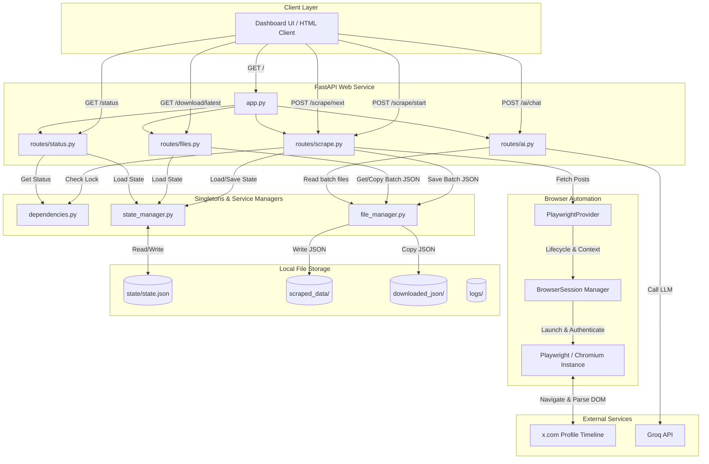
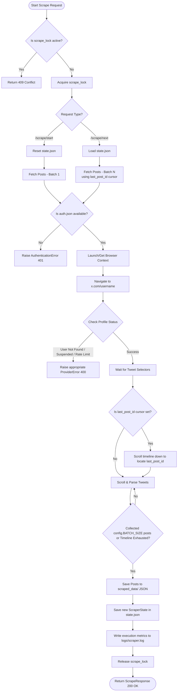
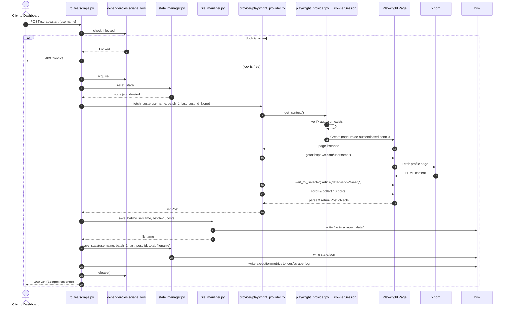
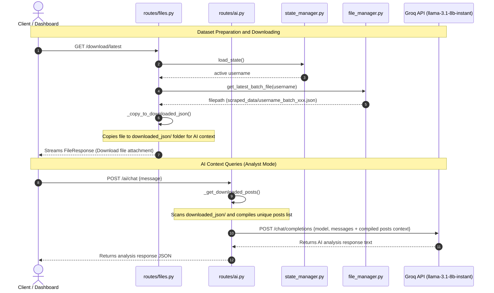

# X (Twitter) Scraper — Architecture & System Diagrams

This document outlines the architecture, data flows, and system logic for the **X (Twitter) Scraper** application. It contains visual maps in Mermaid diagram syntax to illustrate how the application components interact.

---

## 1. High-Level System Architecture

This diagram illustrates the separation of concerns between the Client dashboard, the FastAPI web server routes, the underlying Singleton dependencies, storage mechanisms, and external services.

### Components Summary
* **Entry Point ([app.py](file:///c:/Users/farze/Desktop/Typescript_practice/x-scrapper/twitter_scraper/app.py))**: Bootstraps the application, loads configuration, manages startup/shutdown lifecycles, and registers route modules.
* **Shared State & Singletons ([dependencies.py](file:///c:/Users/farze/Desktop/Typescript_practice/x-scrapper/twitter_scraper/dependencies.py))**: Holds the application singletons, including the execution concurrency lock (`scrape_lock`) and live progress status (`live_progress`).
* **Scraper API Router ([routes/scrape.py](file:///c:/Users/farze/Desktop/Typescript_practice/x-scrapper/twitter_scraper/routes/scrape.py))**: Exposes endpoints to start sessions, request additional batches, and fetch the single latest post.
* **File & Reset Router ([routes/files.py](file:///c:/Users/farze/Desktop/Typescript_practice/x-scrapper/twitter_scraper/routes/files.py))**: Handles browser-initiated state resets and downloads of scraped datasets.
* **AI Analysis Router ([routes/ai.py](file:///c:/Users/farze/Desktop/Typescript_practice/x-scrapper/twitter_scraper/routes/ai.py))**: Reads JSON data files and interfaces with the Groq API for LLM-powered context analysis.
* **Playwright Provider ([provider/playwright_provider.py](file:///c:/Users/farze/Desktop/Typescript_practice/x-scrapper/twitter_scraper/provider/playwright_provider.py))**: Implements browser interaction, scrolling, DOM queries, tweet extraction, and authentication checking.

---

## 2. Scraping Logic Flowchart

This flowchart outlines the step-by-step logic executed during a scraping operation, showing how locks, authentication, browser navigation, scrolling boundary location, and state persistence are handled.

---

## 3. Interaction Sequence Diagrams

### Sequence A: Starting a Scraping Session (`/scrape/start`)

This diagram tracks the messages, database accesses, and browser actions when initiating a new session to collect the first batch of tweets.

---

### Sequence B: Continuing a Scraping Session (`/scrape/next`)

This diagram traces how pagination is handled when fetching the next batch of tweets, using `last_post_id` to orient the scrolling mechanism.

```mermaid
sequenceDiagram
    autonumber
    actor User as Client / Dashboard
    participant API as routes/scrape.py
    participant Lock as dependencies.scrape_lock
    participant State as state_manager.py
    participant File as file_manager.py
    participant Provider as provider/playwright_provider.py
    participant Browser as Playwright Page
    participant X as x.com

    User->>API: POST /scrape/next
    API->>Lock: check if locked
    alt lock is active
        Lock-->>API: Locked
        API-->>User: 409 Conflict
    else lock is free
        API->>Lock: acquire()
        API->>State: load_state()
        State-->>API: Return ScraperState (username, batch, last_post_id)
        
        API->>Provider: fetch_posts(username, batch=N, last_post_id)
        Provider->>Browser: Navigate to "https://x.com/username" (if closed)
        Provider->>Browser: scroll down until last_post_id is found (locate boundary)
        Provider->>Browser: scroll further & collect next 10 unique posts
        Browser-->>Provider: return Post objects
        Provider-->>API: List[Post]
        
        API->>File: save_batch(username, batch=N, posts)
        File->>Disk: write file to scraped_data/
        File-->>API: filename
        
        API->>State: save_state(username, batch=N, new_last_post_id, total, filename)
        State->>Disk: write state.json
        
        API->>Disk: write execution metrics to logs/scraper.log
        API->>Lock: release()
        API-->>User: 200 OK (ScrapeResponse)
    end
```

---

### Sequence C: Downloading Datasets & AI Analysis (`/download/latest` & `/ai/chat`)

This sequence represents the flow of raw data files onto the disk, copying them for the analyst sandbox, and leveraging the Groq API to query context files.

---

## 4. Referenced Components

Below are the key codebase files and components referenced in the diagrams:

* [app.py](file:///c:/Users/farze/Desktop/Typescript_practice/x-scrapper/twitter_scraper/app.py) — Application Entry & Lifespan
* [config.py](file:///c:/Users/farze/Desktop/Typescript_practice/x-scrapper/twitter_scraper/config.py) — Configuration Variables
* [dependencies.py](file:///c:/Users/farze/Desktop/Typescript_practice/x-scrapper/twitter_scraper/dependencies.py) — Singleton Registry & Locks
* [models.py](file:///c:/Users/farze/Desktop/Typescript_practice/x-scrapper/twitter_scraper/models.py) — Scraper Data Models
* [state_manager.py](file:///c:/Users/farze/Desktop/Typescript_practice/x-scrapper/twitter_scraper/state_manager.py) — Session Progress State Tracker
* [file_manager.py](file:///c:/Users/farze/Desktop/Typescript_practice/x-scrapper/twitter_scraper/file_manager.py) — File System IO Helper
* [provider/playwright_provider.py](file:///c:/Users/farze/Desktop/Typescript_practice/x-scrapper/twitter_scraper/provider/playwright_provider.py) — Browser Automation Engine
* [routes/scrape.py](file:///c:/Users/farze/Desktop/Typescript_practice/x-scrapper/twitter_scraper/routes/scrape.py) — Scraper API Endpoints
* [routes/files.py](file:///c:/Users/farze/Desktop/Typescript_practice/x-scrapper/twitter_scraper/routes/files.py) — File Download & State Reset Routes
* [routes/ai.py](file:///c:/Users/farze/Desktop/Typescript_practice/x-scrapper/twitter_scraper/routes/ai.py) — AI Analyst Interface
